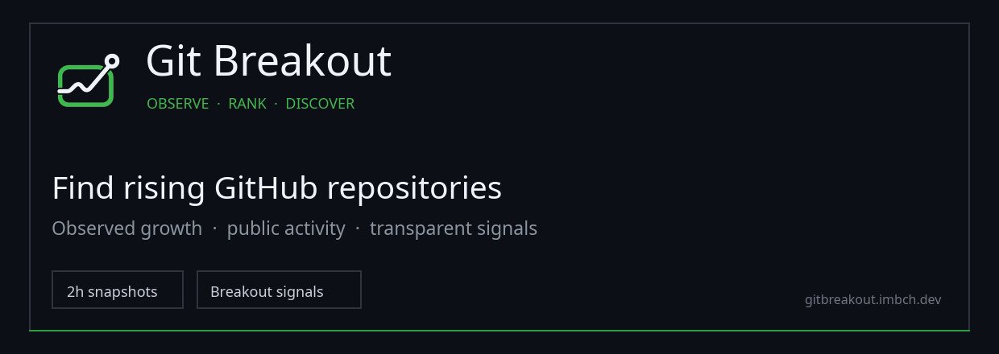
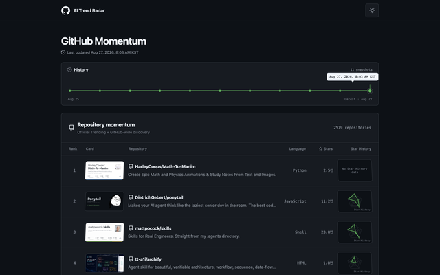
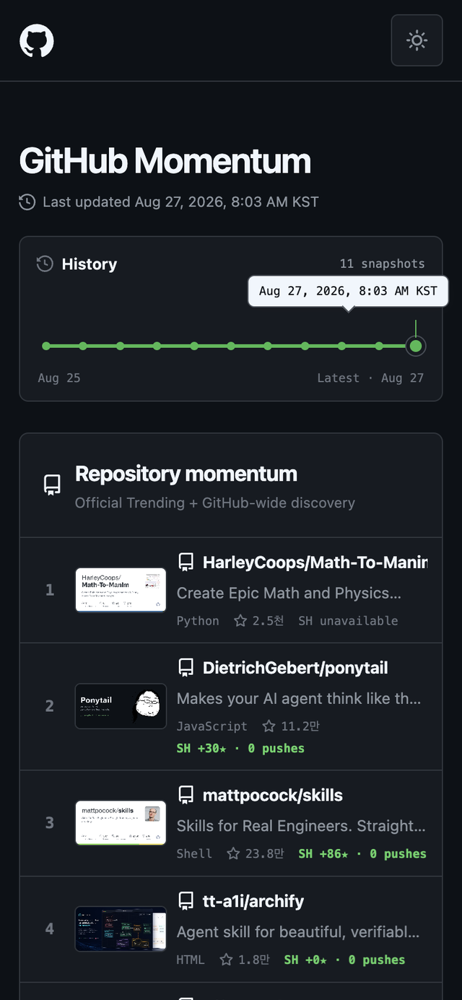

<div align="center">



**A momentum ranking that tracks real repository growth and activity every two hours instead of cloning GitHub Trending.**

[](https://react.dev/)
[](https://www.typescriptlang.org/)
[](https://nodejs.org/)
[](.github/workflows/collect.yml)
[](#status-and-scope)

[한국어](README.md) · [Public web](https://github-trend-radar.imbch.dev) · [API health](https://github-trend-radar.imbch.dev/rpc/health)

</div>

> [!IMPORTANT]
> This is a personal project, not an official GitHub product. The public web app, API, and collection data store run on Oracle A1.

## About

GitHub Trend Radar does more than re-display the current Trending page. It merges current GitHub Trending entries, recently created repositories, recently pushed repositories, and previously observed repositories that still satisfy the retention policy. It then reranks that pool using repeatedly observed star growth and repository activity.

`Momentum` measures **how quickly a repository is gaining attention now**, not its lifetime popularity. Observed growth has a much larger weight than total stars, so established repositories do not automatically dominate the ranking.

### Current candidate pool

| Source | Collection scope | Purpose |
| --- | --- | --- |
| GitHub Trending | Current daily, weekly, and monthly pages | Official exposure signals and current ranks |
| GitHub Search | Repositories created in 7 days or pushed in 24 hours | Discover active repositories outside Trending |
| GH Archive | Watch, Fork, PR, Issue, Comment, Push, and Release events from the last 72 hours | Discover event-active repositories early and measure breadth of attention |
| Bootstrap seeds | Valid public repositories that have not been observed yet | Expand only the first collection pool |
| Previously observed pool | Top 1,000 by prior momentum after a 14-day grace period, 7-day star growth, or a push within 30 days | Track relevant candidates after they leave Trending and Search |
| GitHub GraphQL | Stars, forks, watchers, issues, language, topics, and push time | Refresh current metadata |

Each Search query is capped at 1,000 results, so this project does not claim to be a complete ranking of every GitHub repository. Repositories that fail the retention policy stop receiving new snapshots, but their existing history remains available. A later Trending or Search discovery automatically resumes observation.

## Screenshots

| Desktop | Mobile |
| :---: | :---: |
|  |  |

Every point on the timeline is a persisted ranking snapshot. Selecting a point restores the ranking and repository content captured at that time. Row content uses a flip transition when the selected snapshot or page changes.

## Features

### Discovery and ranking

- **GitHub-wide discovery**: merges three Trending periods and two Search windows while validating renamed or unavailable repositories.
- **14-day cutoff**: gives new repositories a 14-day grace period, then retains candidates with 7-day star growth or a push within 30 days.
- **Two-hour observations**: derives 1-hour, 6-hour, and 24-hour star deltas from persisted measurements.
- **Momentum score**: combines observed growth, age-adjusted star velocity, size, forks, open issues, and recent pushes.
- **Confidence levels**: a first observation is not treated as real growth and is stored with `low` confidence.
- **Shadow Breakout ranking**: compares peer-relative growth, star and actor acceleration, and attention breadth within language, age, and star-size cohorts.
- **Shadow Current Heat ranking**: separates current attention using absolute star velocity, unique actors, activity diversity, and persistence.
- **Evidence states**: stale events or undersized cohorts produce `insufficient_data` with explicit missing evidence instead of an estimated score.

### History and interface

- **Snapshot timeline**: drag across persisted timestamps to inspect earlier rankings.
- **Pagination**: centered previous/next controls and at most ten visible page numbers.
- **Real repository cards**: caches each repository's GitHub Open Graph image.
- **First-party star growth chart**: renders a row-level sparkline from star observations collected since discovery.
- **Responsive UI**: desktop table, mobile cards, and light/dark themes.

### Storage and automation

- **Local development**: stores collection runs, leases, snapshots, and observations in SQLite.
- **Remote operation**: uses an isolated PostgreSQL 17 and PostgREST 14 stack.
- **Scheduled collection**: includes a GitHub Actions workflow designed to collect every two hours.
- **Independent event collection**: GH Archive aggregation runs separately so event-source failures do not block baseline momentum snapshots.
- **Duplicate prevention**: database leases and Actions concurrency prevent overlapping collectors.

## Ranking model

The current score version is `baseline-v1`.

```text
score = log1p(observedStarsPerDay) × 55
      + log1p(stars / ageDays)     × 28
      + log1p(stars)               × 5
      + log1p(forks)               × 2
      + log1p(openIssues)          × 0.5
      + max(0, 14 - pushAgeDays)
      + firstObservationBonus
```

- `observedStarsPerDay` has the largest weight.
- A first observation produces no growth value and receives only a 12-point discovery bonus.
- Real observed velocity starts after an earlier measurement exists at least two hours away.
- Trending ranks affect discovery and reason labels but do not directly add score in this version.
- Ties are resolved by `owner/repository` name for deterministic output.

### Trend Intelligence v2 shadow model

The collector persists optional `Breakout` and `Current heat` views without replacing the default ranking. `Breakout` uses percentiles within matching language, repository-age, and star-size cohorts. `Current heat` uses current star velocity and unique-actor breadth across the candidate pool. It refuses to produce a score when a cohort has fewer than eight repositories or event evidence is more than four hours old.

Public events also expand discovery. Repositories with high unique-actor breadth, activity diversity, and event volume over the last 24 hours join the existing candidate pool before GitHub API validation. Aggregated events expire after 168 hours while ranking snapshots remain intact.

The comparison research, model contract, and promotion criteria are documented in [Trend Intelligence v2 research and design](docs/research/trend-intelligence-v2.md).

```text
Trending + Search + retained pool
                 │
                 ▼
    retention filter and dedupe
                 │
                 ▼
        GitHub GraphQL metadata
                 │
                 ▼
      1h / 6h / 24h growth windows
                 │
                 ▼
       baseline-v1 momentum ranking
                 │
                 ▼
   PostgreSQL snapshot → timeline UI
```

## Historical backfill

The current implementation accurately preserves rankings and growth **from the moment the service starts observing them**. It does not fabricate earlier snapshots.

| Backfill target | Support | Reason |
| --- | --- | --- |
| Past GitHub Trending ranks | Not available | GitHub exposes the current Trending pages but no official historical ranking API. |
| Past fork, issue, and push state | Not available | GitHub returns current metadata, which cannot reconstruct a past snapshot. |
| Older repository discovery | Feasible, not implemented | Time-sliced Search queries could add historically created repositories to the observed pool. |
| Historical star-growth curve | Restricted | It requires `starred_at` listings, but stargazer-list access has been restricted to repository admins and collaborators since July 2026. |

GitHub can include star creation timestamps with `application/vnd.github.star+json`, but the current access restriction is documented in the [official GitHub stargazer documentation](https://docs.github.com/en/rest/activity/starring?apiVersion=2026-03-10#list-stargazers). The ranking therefore uses only snapshots it observed directly instead of mixing in unverifiable estimates for external repositories.

## Getting started

### Requirements

- Node.js 22
- npm
- A GitHub API token that can read public repository metadata

### Local development

```bash
git clone https://github.com/Changroro/github-trend-radar.git
cd github-trend-radar
npm ci
GITHUB_TOKEN=your_token npm run collect
npm run dev
```

Open `http://localhost:5173`. If no snapshot has been collected, the UI reports that no ranking data is available.

### Verification

```bash
npm test
npm run build
```

<details>
<summary><strong>Remote collection and Oracle deployment</strong></summary>

Remote collection requires all three values.

```bash
export GITHUB_TOKEN=your_token
export TREND_RADAR_API_URL=https://your-api.example.com
export TREND_RADAR_COLLECTOR_TOKEN=your_collector_jwt
npm run collect:remote
```

Ingest a completed UTC hour from GH Archive separately:

```bash
npm run collect:events:remote -- --hour=2026-08-28T00:00:00.000Z --limit=5000
```

Before starting the Oracle Compose stack, fill every required `.env.example` value and copy the Cloudflare Tunnel example with your own Tunnel ID and hostname.

Compose runs PostgreSQL, PostgREST, the Node web server, and Cloudflare Tunnel. The web server serves the static UI, loads timeline metadata and only the selected snapshot from PostgREST, and forwards `/rpc/*` collection requests to the internal PostgREST service.

```bash
cp deploy/oracle/.env.example deploy/oracle/.env
cp deploy/oracle/cloudflared.yml.example deploy/oracle/cloudflared.yml
docker compose --env-file deploy/oracle/.env \
  -f deploy/oracle/docker-compose.yml up -d
```

Configure these GitHub Actions values:

| Type | Name |
| --- | --- |
| Actions variable | `TREND_RADAR_API_URL` |
| Actions secret | `COLLECTOR_GITHUB_TOKEN` |
| Actions secret | `TREND_RADAR_COLLECTOR_TOKEN` |

</details>

## Technology

| Area | Stack |
| --- | --- |
| Frontend | React 19, TypeScript, Vite, Radix Slider, Primer Octicons |
| Collector | Node.js, GitHub REST/Search/GraphQL, Cheerio |
| Public events | Hourly GH Archive event aggregation |
| Local storage | SQLite, better-sqlite3 |
| Remote storage | PostgreSQL 17, PostgREST 14 |
| Network | Cloudflare Tunnel |
| Automation | GitHub Actions, two-hour cron |
| Tests | Vitest, strict TypeScript build |

## Status and scope

- This is a personal project with the public web app, API, and scheduled collector operating.
- Star charts use only snapshots collected directly by this project, with no external data service.
- Trend Intelligence v2 remains in shadow mode; the verified `baseline-v1` stays the default ranking.
- This project is not affiliated with GitHub and remains subject to GitHub's trademarks and service terms.
- The source repository is private and does not grant redistribution rights.

### Roadmap

- [ ] Time-sliced repository discovery backfill with explicit completeness states
- [x] On-demand PostgREST snapshot reads from the public web UI
- [ ] Remote database backup and snapshot retention policy
- [x] First-party observed star growth charts without an external data service
- [ ] Accuracy view comparing v2 predictions with actual outcomes after 24 and 72 hours

---

<div align="center">
Built by <a href="https://github.com/Changroro">Changroro</a>
</div>
